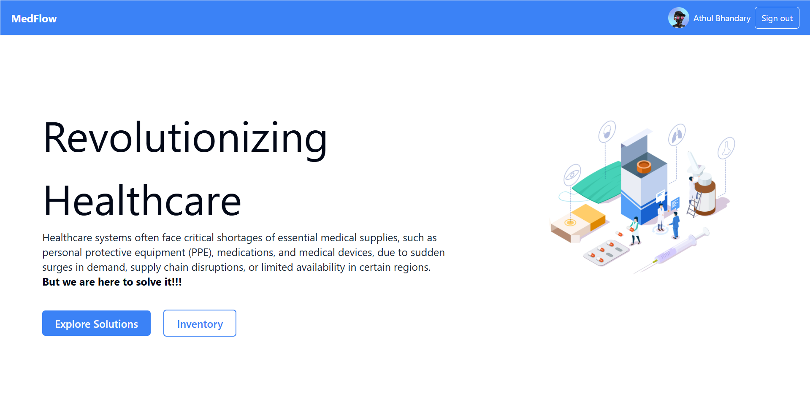

# Smart Resource Allocation & Supply Chain Optimization for Healthcare

This project is designed to improve resource allocation and supply chain efficiency in healthcare. The platform allows healthcare facilities and humanitarian organizations to manage, track, and optimize the distribution of essential resources, especially during critical times.


Hosted link: https://git-committed.vercel.app/

## Features

- **Real-time Resource Tracking**: Monitor and update inventory levels in real time.
- **Nearby Supply Centers**: Locate and display nearby medicine supply centers using Google Maps.
- **Resource Allocation**: Dynamic allocation of resources based on need and supply availability.
- **Google Authentication**: Secure user access with Google Auth API for a streamlined login experience.
- **Data Management with Prisma**: Efficient data storage and retrieval using Prisma ORM with a CockroachDB database.
## Technology Stack

- **Frontend**: Svelte with Tailwind CSS for a responsive UI.
- **Backend**: SvelteKit, and Prisma ORM.
- **Database**: CockroachDB
- **Google Maps & Google Auth API**: Integrated for location-based services and secure authentication.

## Getting Started

1. **Clone the repository**:

   ```bash
   git clone https://github.com/your-username/your-repo.git
   cd your-repo
   ```

2. **Install dependencies**:

   ```bash
   npm install
   ```

3. **Configure environment variables**:  
   Create a `.env` file with the following variables:

   - `GOOGLE_MAPS_API_KEY`: Your Google Maps API Key
   - `GOOGLE_CLIENT_ID`: Client ID for Google Auth API
   - `GOOGLE_AUTH_SECRET`: Secret Key for Google Auth API
   - `DATABASE_URL`: CockroachDB connection URL

4. **Run the project**:
   ```bash
   npm run dev
   ```

## Usage

1. **Google Authentication**: Log in using your Google account.
2. **Resource Management**: Add, update, or remove resources as needed.
3. **Map Integration**: Use the map to find nearby supply centers and update resource details accordingly.
